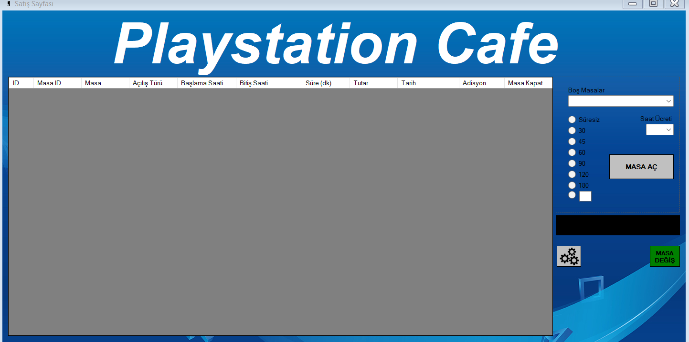
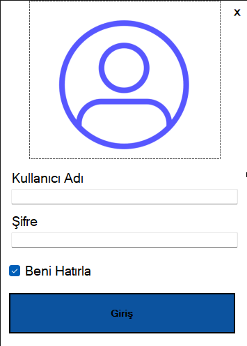
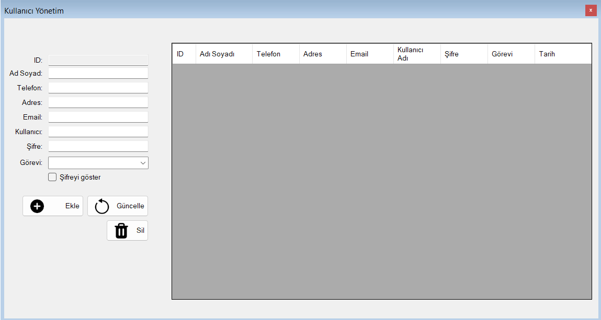
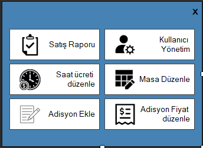

# PlaystationCafe

C# Windows Forms ve SQL kullanarak geliştirdiğim Playstation Cafe uygulaması.

**Program Dili:** Türkçe  
**Kullanılması Zorunlu:** SQL Server Management Studio

## Fonksiyonlar

- Masa Aç/Kapat
- Masa Adisyon Ekle/Sil
- Konsol Saat Ücreti Güncelleme
- Kullanıcı Ekle/Sil/Güncelleme
- Satış Raporu Gösterme

## Ekran Görüntüleri
  
  
  
  
  

